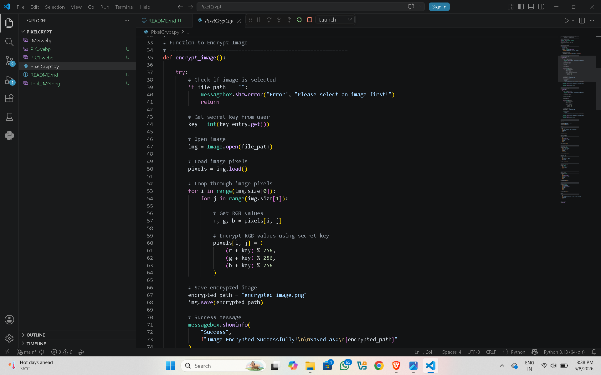

# 🔐 PixelCrypt

## 📌 Overview

PixelCrypt is a simple Image Encryption and Decryption Tool developed using Python.
This project uses **pixel manipulation techniques** to secure images by modifying RGB pixel values using a secret key.

The application allows users to:

* Encrypt images
* Decrypt encrypted images
* Use a secret key for security
* Perform image processing through a simple GUI interface

---

# 🚀 Features

✅ Simple and User-Friendly GUI
✅ Image Encryption
✅ Image Decryption
✅ Secret Key Based Protection
✅ Pixel Manipulation Technique
✅ RGB Value Modification
✅ Beginner Friendly Cybersecurity Project

---

# 🛠 Technologies Used

* Python
* Tkinter (GUI)
* Pillow Library (Image Processing)

---

# 📂 Project Structure

```bash
PixelCrypt/
│
├── pixelcrypt.py
├── encrypted_image.png
├── decrypted_image.png
└── README.md
```

---

# ⚙️ How It Works

The program performs encryption by:

1. Reading image pixels
2. Extracting RGB values
3. Applying mathematical operations using a secret key
4. Saving the encrypted image

For decryption:

* The same secret key reverses the operation
* Original image is restored

---

# ▶️ Installation

## Install Required Library

```bash
pip install pillow
```

---

# ▶️ Run the Program

```bash
python pixelcrypt.py
```

---

# 🖼 GUI Preview

The application provides:

* Image Selection Button
* Secret Key Input
* Encrypt Button
* Decrypt Button

---

# 🔒 Encryption Technique

PixelCrypt uses:

* Pixel Manipulation
* RGB Color Transformation
* Modular Arithmetic (% 256)

This ensures that pixel values remain within the valid RGB range.

---

# 🎯 Learning Outcomes

Through this project, I learned:

* Image Processing using Python
* GUI Development with Tkinter
* Pixel Manipulation Techniques
* Basic Cryptography Concepts
* RGB Value Operations

---


# 📸 Project Screenshots

## 🖥 Main GUI


---

## 🔐 Image Encryption


---

## 🔓 Image Decryption


---

## 💻 Source Code




# 📌 Internship Project

This project was completed as part of the Cyber Security Internship at Prodigy InfoTech.

---

# 👨‍💻 Developed By

Amir Shaikh
